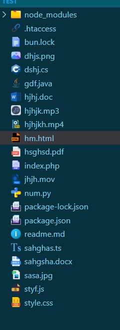

# icon-theme
🌟 Enhance your VS Code experience with a modern and visually appealing icon theme!

The File Extension Icon Theme extension brings a fresh and professional look to your editor by assigning unique icons to different file types. Whether you're working with programming languages, config files, or project assets, this theme improves visibility and organization in your workspace.

🔥 Features
- Custom Icons for Popular File Extensions – Supports HTML, CSS, JS, PHP, Python, JSON, and more!
- Beautiful & Clean Design – Aesthetic and easy-to-distinguish icons.
- Supports Dark & Light Themes – Works seamlessly with any VS Code theme.
- Optimized for Performance – Lightweight and fast.
- Frequent Updates – More file types added regularly.

## Screenshots 

